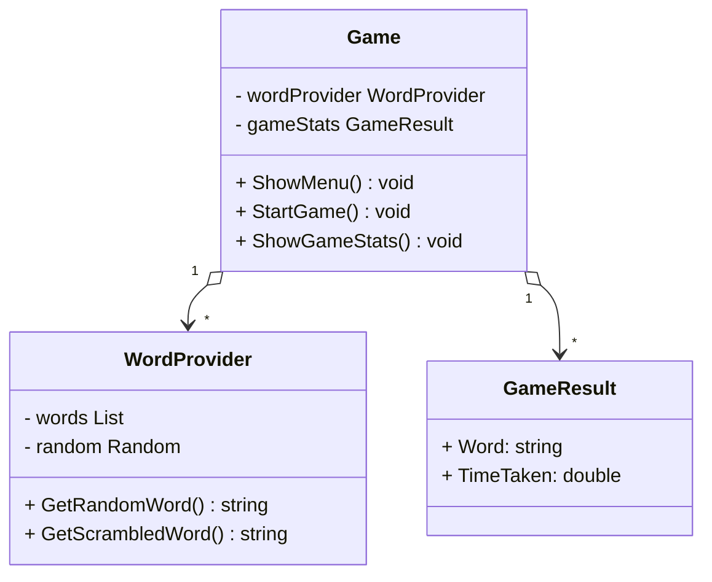

```mermaid
classDiagram
    class WordProvider{
        - words List<string>
        - random Random

        + GetRandomWord() string
        + GetScrambledWord() string
    }

    class GameResult{
        + Word: string
        + TimeTaken: double
    }

    class Game{
        - wordProvider WordProvider
        - gameStats GameResult

        + ShowMenu() void
        + StartGame() void
        + ShowGameStats() void
    }

    Game "1" o--> "*" WordProvider
    Game "1" o--> "*" GameResult
```